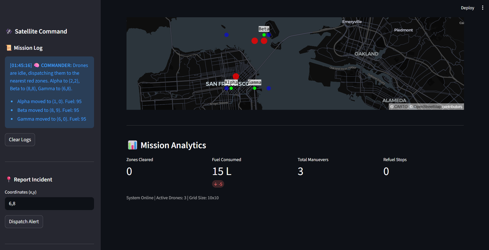
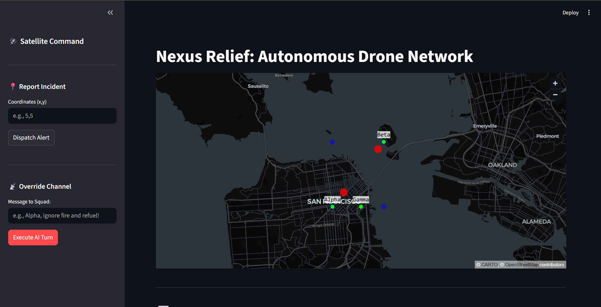

# 🚁 Nexus Relief: Autonomous Multi-Agent Disaster Response

**A Collaborative AI System for Humanitarian Logistics**
*Built for the Kaggle 5-Day Agents Intensive Capstone*

![Project Screenshot]



## 📖 The Problem
In disaster scenarios (wildfires, floods), decision-making is the bottleneck. Human dispatchers are overwhelmed by data. **Nexus Relief** solves this by creating an **Autonomous Hive Mind** that manages a fleet of drones to extinguish fires and rescue survivors efficiently.

## 🛠️ Key Concepts Implemented
This project demonstrates **3 Core Agent Concepts**:

### 1. Multi-Agent System (Sequential & Hierarchical)
* **The Commander (Brain):** An LLM-powered agent that analyzes the entire map state.
* **The Drones (Field Units):** Autonomous units that execute specific movement/refuel tasks.
* **Logic:** The system uses a "Central Dispatch" architecture where the Commander assigns tasks based on proximity and fuel levels, resolving conflicts before they happen.

### 2. Tools & Function Calling
The Agent does not just output text; it executes **Python Functions** to manipulate the simulation:
* `move_drone(id, x, y)`: Navigates the grid.
* `refuel_drone(id)`: Triggered automatically when fuel is critical.
* **Human Override Tool:** A unique "Human-in-the-Loop" tool allowing the user to inject priority commands that override the AI's standard logic.

### 3. Sessions & Memory
* **Short-Term Memory:** The Agent receives the real-time "World State" (Fuel, Zones, Locations) at every turn.
* **Long-Term Persistence:** The `Mission Log` persists across Streamlit reruns, maintaining a history of tactical decisions and human orders.
* **State Management:** Usage of `st.session_state` to track the evolving simulation grid.

## 🚀 How to Run

1.  **Clone the Repository**
    ```bash
    git clone [https://github.com/Abhinav-0709/nexus-relief.git](https://github.com/Abhinav-0709/nexus-relief)
    cd nexus-relief
    ```

2.  **Install Dependencies**
    ```bash
    pip install -r requirements.txt
    ```

3.  **Configure API Key**
    * Create a `.env` file.
    * Add: `GOOGLE_API_KEY=your_gemini_key_here`

4.  **Launch the Dashboard**
    ```bash
    streamlit run app.py
    ```

## 🎮 How to Use
1.  **Observe:** Green dots are Drones, Red dots are Fires.
2.  **Dispatch:** Click **"Execute AI Turn"** to let the Gemini Commander decide the next best move.
3.  **Analyze:** Read the **"Mission Log"** sidebar to see the AI's tactical reasoning.
4.  **Override:** Use the text box to order specific agents (e.g., *"Alpha, ignore fire and refuel!"*).

## 📊 Tech Stack
* **Python 3.10+**
* **Streamlit:** For the interactive web interface.
* **PyDeck:** For high-performance map visualization.
* **Google Gemini (GenAI SDK):** For the Agent reasoning engine.
